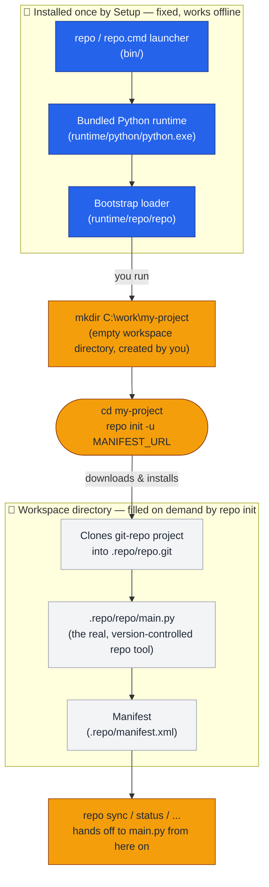

# Google repo for Windows

**repo** manages multiple Git repositories together. A manifest file defines which repositories belong to a project and which versions are used. repo complements Git; it does not replace Git.

This installation package makes repo available in the Windows Command Prompt (CMD), PowerShell, and Git Bash. A dedicated Python runtime is included.
You do not need to install Python separately or activate an environment.
Existing Python installations are not modified.

## Prerequisites

- Windows 10 or Windows 11 on an **x64 system**.
- **[Git for Windows](https://gitforwindows.org/)** is installed and available from your console.
  Verify this with `git --version`.
- Administrator rights for the installation and Windows settings.
- For your project: the manifest URL, optionally a branch and manifest filename,
  as well as the required access permissions.
  You can obtain this information from the project team.
- Network access to the participating Git servers; depending on the environment,
  also VPN, SSH keys, or HTTPS credentials.

## Installation

1. Start the provided installer and confirm the Windows prompt for administrator privileges.
2. Select the installation directory. The default is `C:\Program Files\repo`.
3. If repo was previously installed using this package, Setup first attempts to uninstall the old version.
   The process is displayed. If it fails, the new installation continues anyway;
   pay attention to any warnings.
4. At the end, you can **restart now or later**. “Later” is preselected.
   At a minimum, sign out and sign back in so that new user rights take effect.
5. Open a new console and verify the installation with `repo --help`.

There is **no desktop or Start menu shortcut**: repo is a command-line tool.
Use it in the console within your project's working directory, **not** in the installation directory.

### What does Setup change in Windows?

- It adds the repo command to the user's search path.
- It enables Developer Mode unless a policy prevents it.
- It grants the **user who launched Setup** the right
  **“Create symbolic links”**.
  Such links can point to files or directories and are required by some projects.

On managed corporate computers, central policies may block or later revert these settings.
In that case, contact your IT department. Google's repo tool uses extensively symbolic links.

## Getting Started with a Project

Create a dedicated writable working directory, for example
`C:\work\my-project`, and change to it in the console.

Perform the following steps there. Replace the uppercase placeholders
with the values provided for your project; they are not complete example addresses.

| Step | Command | Meaning |
| --- | --- | --- |
| Set up the project | `repo init -u MANIFEST_URL` | Connects the working directory to the manifest. |
| Select a specific project configuration | `repo init -u MANIFEST_URL -b BRANCH -m MANIFEST.xml` | Alternative to the simple command when your team specifies a branch and manifest file. |
| Download or update repositories | `repo sync` | Synchronizes the repositories described by the manifest. |
| View local changes | `repo status` | Shows the status of the project repositories. |
| Get help for a command | `repo help sync` | Explains options and behavior of the command. |

**Before synchronizing, save local changes**, for example by creating commits
according to your project's guidelines. Do not use options that discard local changes
or force checkouts without understanding their effect.

### What Works Offline?

**The installation does not require Internet access.**
The package contains the repo launcher and the required Python runtime.

This does not mean that a project is available offline:
`repo init` normally downloads additional repo components and the manifest;
`repo sync` requires access to the Git repositories.
The corresponding servers must therefore be reachable, possibly through a VPN
or an internal network.

### How the Bootstrap Loader and the repo Tool Work Together

The installer only puts a small, fixed **bootstrap loader** on your computer.
The actual **repo tool** is downloaded per project the first time you run
`repo init`, and lives inside that project's working directory.

In short: the Windows package only guarantees that `repo` is always found and
that a matching Python runtime exists — nothing more is installed up front.
You first create an empty **workspace directory** for your project yourself;
running `repo init` inside it is what actually "installs" the real repo tool:
the bootstrap loader downloads it into that directory's `.repo` folder, and
every subsequent command (`repo sync`, `repo status`, ...) is handed off to
that downloaded copy.

## Common Problems

### “repo” is not found

- Close the console and open it again. For integrated terminals,
  a restart of VS Code or Windows Terminal may also be required.
- In CMD or PowerShell, use `where.exe repo`; in Git Bash, use
  `type -a repo` to determine which command is found.
- If multiple results are returned, an older installation may appear first in the search path.
  Verify the paths before removing entries.
- If Setup was started using a different administrator account,
  the user search path of that account may have been modified.
  Your IT department can add the installation's `bin` subfolder to your user search path.

### “repo is not yet installed”

**Outside of an initialized project, this message from the repo launcher is normal**.
Initialize the desired working directory using `repo init`.
The message does not automatically indicate that the Windows installation failed.

### Git access or synchronization fails

First verify `git --version`, your VPN connection, the server address,
and your Git access permissions.
Missing SSH keys or expired credentials cannot be fixed by reinstalling repo.
Provide the complete error message to your project team.

### Symbolic links cannot be created

1. Sign out and sign back in after installation, or restart Windows.
2. Search for **“Developer Mode”** in Windows Settings and verify its status.
3. In the **Local Security Policy**, under **Local Policies →
   User Rights Assignment → Create symbolic links**, verify that
   **your user account** is listed, including the domain prefix if applicable.
4. If a different user account was used or a corporate policy blocks the setting,
   contact your IT department.
   The Local Security Policy management tool is not available in all Windows editions.

### Setup reports a configuration error

The program files may already be installed even if a Windows setting
could not be applied. Therefore, do not ignore the message.
Details are available in
`C:\ProgramData\repo-installer.log`
(or under `%ProgramData%` if your system configuration differs).
Provide the error text and the entries from the latest installation run to IT.
Do not send credentials or tokens.

## Updating and Uninstalling

To update, start the new installer.
Save your work beforehand and close any running repo commands.
Project working directories belong outside the installation directory;
projects stored there are not managed by the installer.

To remove the software, open **Windows Settings → Apps**,
search for **Google's repo tool for Windows**, and select **Uninstall**.
For older packages, the entry may simply be called **repo**.

Developer Mode and assigned user rights are **not automatically reverted**
during uninstallation. A remaining repo search path entry may also require
manual cleanup. Coordinate any changes to security rights with IT, as other
tools may rely on them as well.

## Maintainers
[Thomas Pollerspöck](mailto:Thomas.Pollerspoeck@de.bosch.com)

## Origin and License

This **repo tool for Windows** packaging (installer, launchers, and build
scripts) is itself licensed under the **Apache License 2.0**; see
[LICENSE](LICENSE) in the root of this repository.

This package also includes Google **repo** from the **Android Open Source Project**,
licensed under the **Apache License 2.0**.
Copyright and license notices from the original script remain intact.

- runtime/repo/LICENSE
- runtime/repo/THIRD-PARTY-NOTICES.txt
- [Official repo Project](https://gerrit.googlesource.com/git-repo/)

These third-party files are also included in the installation directory
under `runtime\repo`.

The installer itself is built with **Inno Setup**, copyrighted by Jordan Russell
(Copyright © 1997-2012 Jordan Russell, portions Copyright © 2000-2012 Martijn Laan).
Inno Setup is free to use, including for commercial applications; see

- tools/InnoSetup5.5.1/license.txt
